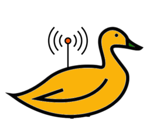

# Radio-Duck
A duckDb server, you can talk to.

## Project Objectives

- Talk to duckDb over transport protocols like Http.
- Provide an alternative to embedding duckDb
- Make DuckDb highly available for apps like Business intelligence dashboards
- Ability to query data while data is being loaded.
``
## Use cases

- Act as database server for Business intelligence dashboards like (metabase/superset) without embedding duckDb

## Features

- Run sql on Duckdb over http [wip]
- Load data from cloud blob storage like s3/azure [todo]
- Consume data from streams like kafka [todo]
